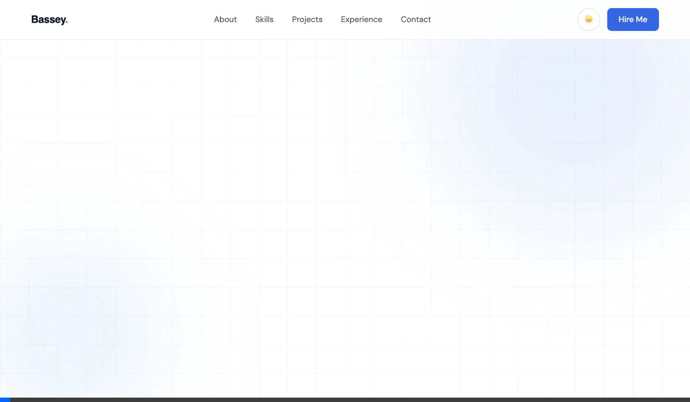

# Bassey Okon | Portfolio Website

A clean, responsive, and performance-optimized personal portfolio designed for a Remote Operations Specialist & AI Workflow Builder. This lightweight static site scores **98 on Lighthouse** and relies entirely on Semantic HTML5, CSS3, and Vanilla JavaScript—with **zero external framework dependencies**.

 <!-- NOTE: Ensure this preview image exists if you want to keep the tag, otherwise remove it -->

## ✨ Features

- **Semantic HTML5** & **Modern CSS3 (Flexbox/Grid)**
- **Fully Responsive**: Mobile-first approach, works seamlessly across all device sizes.
- **Dark Mode Toggle**: Built-in theme switching via CSS root variables and persistence using `localStorage`.
- **Smooth Animations**: Intersection Observer API for delicate scroll-triggered fade-in effects.
- **Projects Showcase**: Dynamic grid layout highlighting web applications and integrations with tech stacks and live/GitHub links.
- **Zero Dependencies**: No React, Vue, jQuery, or Bootstrap. Pure vanilla web technologies for maximum performance.

## 🚀 Live Demo

[View Live Portfolio Here](https://btcbarbie.github.io/basseyonline/)

## 🛠 Tech Stack

- **HTML5**: Semantic document structure
- **CSS3**: Custom properties, Flexbox, Grid, Media Queries, CSS Transitions
- **JavaScript (ES6+)**: DOM manipulation, Event Listeners, `IntersectionObserver`, `localStorage`

## 💻 Running Locally

Since this is a vanilla static site, no build steps or servers are required.

1. Clone the repository:
   ```bash
   git clone https://github.com/btcbarbie/basseyonline.git
   ```
2. Navigate to the project directory:
   ```bash
   cd basseyonline
   ```
3. Open `index.html` directly in your browser, or use a tool like Live Server (VS Code) for hot-reloading.

## 📬 Contact

- **Email**: okon.basseym@gmail.com
- **LinkedIn**: [linkedin.com/in/bassey-okon-a8080a256](https://linkedin.com/in/bassey-okon-a8080a256)
- **Twitter**: [@bassey___O](https://twitter.com/bassey___O)
